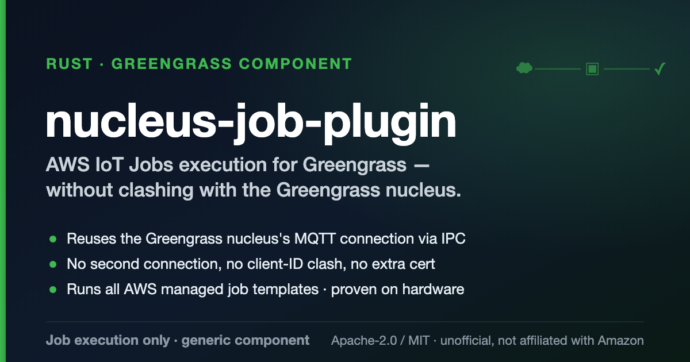

# nucleus-job-plugin

<p align="center">
  
</p>

An **unofficial**, community **Rust runner for AWS IoT Jobs** on a Greengrass device. It mirrors the
*Jobs* feature of the [`aws-iot-device-client`](https://github.com/awslabs/aws-iot-device-client) —
**job execution only**.

> ⚠️ **Not affiliated with, endorsed by, or sponsored by Amazon.** "AWS IoT", "Greengrass", and
> "IoT Jobs" are used descriptively/nominatively.

> 🔗 **Related:** reaches AWS IoT Core through the nucleus's own connection using
> [`greengrass-ipc`](https://github.com/eduelias/greengrass-ipc) — a pure-Rust Greengrass IPC client
> (also on [crates.io](https://crates.io/crates/greengrass-ipc)).

## What it does

- Speaks the **AWS IoT Jobs MQTT protocol** (`$aws/things/{thingName}/jobs/...`).
- Waits for the next queued job (via `notify-next` / `start-next`), marks it `IN_PROGRESS`, runs an
  **allow-listed handler** named by the job document, and reports `SUCCEEDED` / `FAILED` /
  `TIMED_OUT` back to the cloud.
- Runs as a **generic Greengrass component** — its own supervised process.

### Naming note

Despite the folder name, a Rust program **cannot** be a Greengrass nucleus *plugin*: the
`aws.greengrass.plugin` component type runs inside the nucleus JVM and is **Java only**. This project
ships a standalone binary as a **generic component** (`aws.greengrass.generic`).

## Scope

**In scope:** IoT Jobs *execution* — pick up a job, run a handler, report status.

**Out of scope** (by design): OTA / jobs-with-file-download, fleet provisioning, secure tunneling,
device defender, config shadow. This mirrors *only* the device client's Jobs feature.

Like the AWS `aws.greengrass.SecureTunneling` component, this is a **generic component** that runs as
a long-lived daemon reacting to an MQTT notify topic — here `$aws/things/{thing}/jobs/notify-next`. It
declares a soft dependency on the Greengrass nucleus (`>=2.0.0 <3.0.0`).

## Architecture

| Module | Responsibility |
|---|---|
| `jobs::model` | JSON shapes for the Jobs protocol + job-document parsing |
| `jobs::topics` | reserved `$aws/things/{thing}/jobs/...` topic builders |
| `jobs::engine` | the workflow state machine |
| `handler` | action execution: allow-listed `runHandler` + `runCommand`, timeout, capture, status map |
| `transport` | the `JobsTransport` trait + a Greengrass-IPC impl (default), a direct-MQTT impl (`rumqttc`), and an in-memory mock |

The engine is transport-agnostic, so the whole workflow is unit-tested with a mock transport and fake
handler scripts — no network or AWS account required.

## Job document

Supports the `aws-iot-device-client` / **AWS managed job template** schema, with two action types.

**`runHandler`** — run an allow-listed handler executable:

```jsonc
{
  "version": "1.0",
  "steps": [{
    "action": {
      "type": "runHandler",
      "input": { "handler": "download-file.sh", "args": ["https://…", "/opt/f"], "path": "" },
      "runAsUser": ""
    }
  }]
}
```

A flat convenience form is also accepted: `{ "operation": "my-handler.sh", "args": ["a"] }`.

**`runCommand`** — run a comma-separated argv directly, no shell (the `AWS-Run-Command` template):

```jsonc
{ "steps": [{ "action": { "type": "runCommand",
  "input": { "command": "systemctl,restart,my.service" }, "runAsUser": "root" } }] }
```

### AWS managed templates

All AWS managed job templates are supported out of the box. `${aws:iot:parameter:…}` placeholders are
substituted server-side by AWS, so the device receives concrete values. The bundled **AWS sample job
handlers** (Apache-2.0) implement the device side:

| Template | Action | Handler / command |
|---|---|---|
| `AWS-Download-File` | runHandler | `download-file.sh` |
| `AWS-Install-Application` | runHandler | `install-packages.sh` |
| `AWS-Remove-Application` | runHandler | `remove-packages.sh` |
| `AWS-Start-Application` | runHandler | `start-services.sh` |
| `AWS-Stop-Application` | runHandler | `stop-services.sh` |
| `AWS-Restart-Application` | runHandler | `restart-services.sh` |
| `AWS-Reboot` | runHandler | `reboot.sh` |
| `AWS-Run-Command` | runCommand | provided command argv |

### Execution & security

- **runHandler** resolves the handler as a **bare file name** inside the handler directory (path
  separators / `..` rejected). A `path` override is honored only if it's on the configured allow-list.
  Following the device-client convention, the handler is invoked with `runAsUser` as its **first
  argument** (empty when unset) and drops privileges itself (`sudo -u "$user"`).
- **runCommand** runs argv directly (no shell → no injection). It may be restricted with
  `COMMAND_ALLOW_LIST`. When the runner is root and `runAsUser` is set, it drops to that user's
  uid/gid natively.
- Exit `0` → `SUCCEEDED`; non-zero → `FAILED`; over the timeout → `TIMED_OUT`, with the reason and
  captured `stderr` in `statusDetails`.

## Configuration (environment)

| Variable | Default | Meaning |
|---|---|---|
| `THING_NAME` | *(required)* | thing name / MQTT client id / topic segment |
| `HANDLER_DIR` | `/var/lib/nucleus-job-plugin/handlers` | allow-list directory of handlers |
| `JOB_TIMEOUT_SECS` | `300` | default per-job handler timeout |
| `INCLUDE_STDOUT` | *(off)* | `1`/`true` to include stdout in `statusDetails` |
| `TRANSPORT` | `ipc` | `ipc` (Greengrass IPC, recommended) or `mqtt` (direct MQTT) |
| `HANDLER_PATH_OVERRIDES` | *(none)* | comma-separated extra dirs a job `path` may use |
| `COMMAND_ALLOW_LIST` | *(any)* | comma-separated allow-list for `runCommand` executables |
| `IOT_ENDPOINT` | *(required for `mqtt`)* | `xxxx-ats.iot.<region>.amazonaws.com` |
| `IOT_PORT` | `8883` | MQTT port (direct MQTT only) |
| `MQTT_CLIENT_ID` | `{thing}-jobs` | MQTT client id (direct MQTT only); must differ from the nucleus's |
| `CERT_PATH` / `KEY_PATH` / `CA_PATH` | *(required for `mqtt`)* | device cert, key, Amazon Root CA |

## Transports

- **`ipc` (default, recommended):** reuse the nucleus's own MQTT connection via `SubscribeToIoTCore` /
  `PublishToIoTCore` (the [`greengrass-ipc`](https://github.com/eduelias/greengrass-ipc) SDK). No
  device certificate and no second MQTT connection — the component is authorized for the Jobs topics
  through an `aws.greengrass.ipc.mqttproxy` policy in its recipe (`$aws/things/${iot:thingName}/jobs/*`).
- **`mqtt`:** open a dedicated MQTT/TLS connection with a device certificate. Use a `MQTT_CLIENT_ID`
  distinct from the nucleus and a certificate whose IoT policy allows the reserved jobs topics.

> Validated on hardware: an `AWS-Restart-Application` managed-template job deployed to a Greengrass
> core device (nucleus 2.17, aarch64) is delivered over IPC, runs the bundled handler, and reaches
> `SUCCEEDED` in the cloud.

## Try it locally (no AWS)

```bash
cargo run --example local_run
```

Feeds a canned job through the mock transport, runs a temp handler, and prints what the engine
publishes.

## Deploying as a Greengrass component

The component (`dev.du7.nucleus-job-plugin`) is a generic component with a soft nucleus dependency.
The recipe template ([`recipe.json`](recipe.json)) and Install script
([`greengrass/files/setup.sh`](greengrass/files/setup.sh)) install the binary, create the handler
allow-list directory owned by the component user, and (by default) install the bundled AWS sample job
handlers so managed templates work immediately.

Build, publish, and deploy with the [GDK CLI](https://docs.aws.amazon.com/greengrass/v2/developerguide/greengrass-development-kit-cli.html)
(config in [`gdk-config.json`](gdk-config.json)):

```bash
# 1. Build: cross-compiles the aarch64 binary in a container and stages artifacts
#    (see greengrass/build-custom.sh).
gdk component build

# 2. Publish: uploads artifacts to S3 and creates the next component version.
#    --bucket pins the existing artifact bucket (otherwise GDK appends -region-account).
AWS_PROFILE=<profile> AWS_REGION=<region> gdk component publish --bucket <artifact-bucket>

# 3. Deploy to a device (create-deployment + wait for RUNNING).
AWS_PROFILE=<profile> AWS_REGION=<region> greengrass/deploy.sh <version> <thing-name>
```

The build runs in a container via `podman` by default (override with `CONTAINER_ENGINE=docker`). For
the direct-MQTT transport instead of IPC, set `transport: mqtt` in the component configuration and
supply the device credentials.

> Validated on hardware end-to-end: GDK-built `dev.du7.nucleus-job-plugin` deployed to a Greengrass
> core device (nucleus 2.17, aarch64), and an `AWS-Restart-Application` managed-template job delivered
> over IPC runs the bundled handler and reaches `SUCCEEDED` in the cloud.

## License

Dual-licensed under either of [Apache-2.0](LICENSE-APACHE) or [MIT](LICENSE-MIT) at your option.
